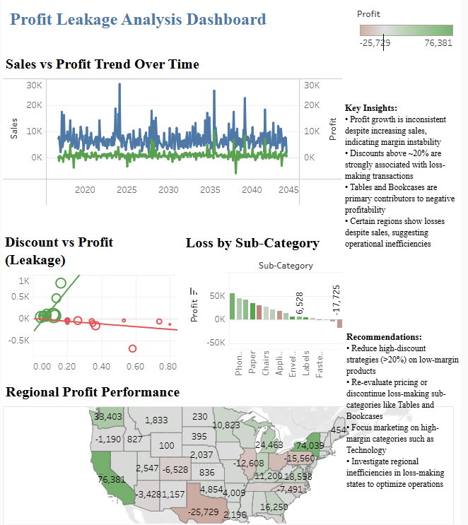

# Profit Leakage Analysis using Tableau

## Problem Statement
Sales were increasing, but profits were inconsistent.  
This project identifies factors causing profit leakage.

## Key Insights
- High discounts (>20%) lead to negative profit  
- Tables & Bookcases are major loss drivers  
- Some regions show losses despite strong sales  

## Recommendations
- Reduce high discounts  
- Focus on high-margin products  
- Improve loss-making categories  

## Tools Used
- Tableau  
- Excel  

## Dashboard Preview
